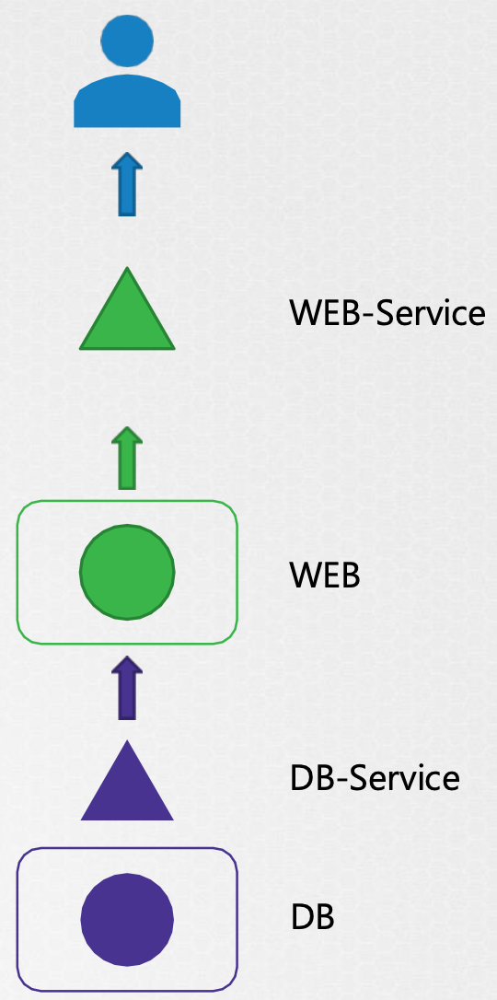
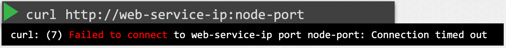
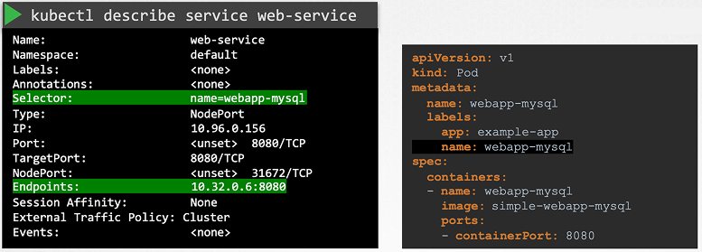
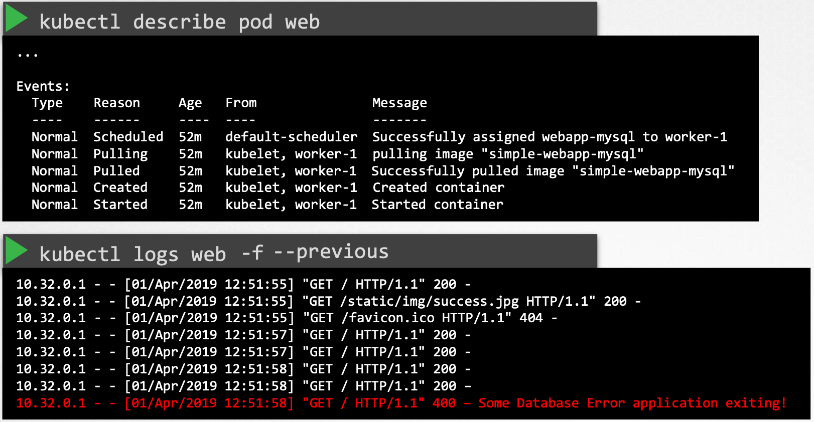

## 애플리케이션 오류 접근 방법

전체 구조를 생각하여 어떻게 접근할 것인지 생각하고 문제의 원인을 찾을 때 까지 모든 오브젝트와 링크를 확인하자.

## 예시

애플리케이션이 아래 사진과 같이 구조를 가지고 있다고 가정해보자.

{: width="60%" height="60%"}{: .center}

사용자가 애플리케이션에 접근하는데 문제가 발생하였을때, 아래와 같이 사용자단에서부터 확인해보자.

먼저 curl 명령어를 사용해서 WEB-Service(service)에 접근가능한지 확인한다.

{: width="100%" height="100%"}{: .center}

**Connection time out**이 발생했으니 WEB-Service(service)와 WEB(pod)간의 문제가 있는지 확인한다.

{: width="100%" height="100%"}{: .center}

문제가 없으니 이제는 WEB(pod)이 정상적으로 작동하고 있는지 확인한다.

위와 같은 방법으로 DB도 확인해본다.