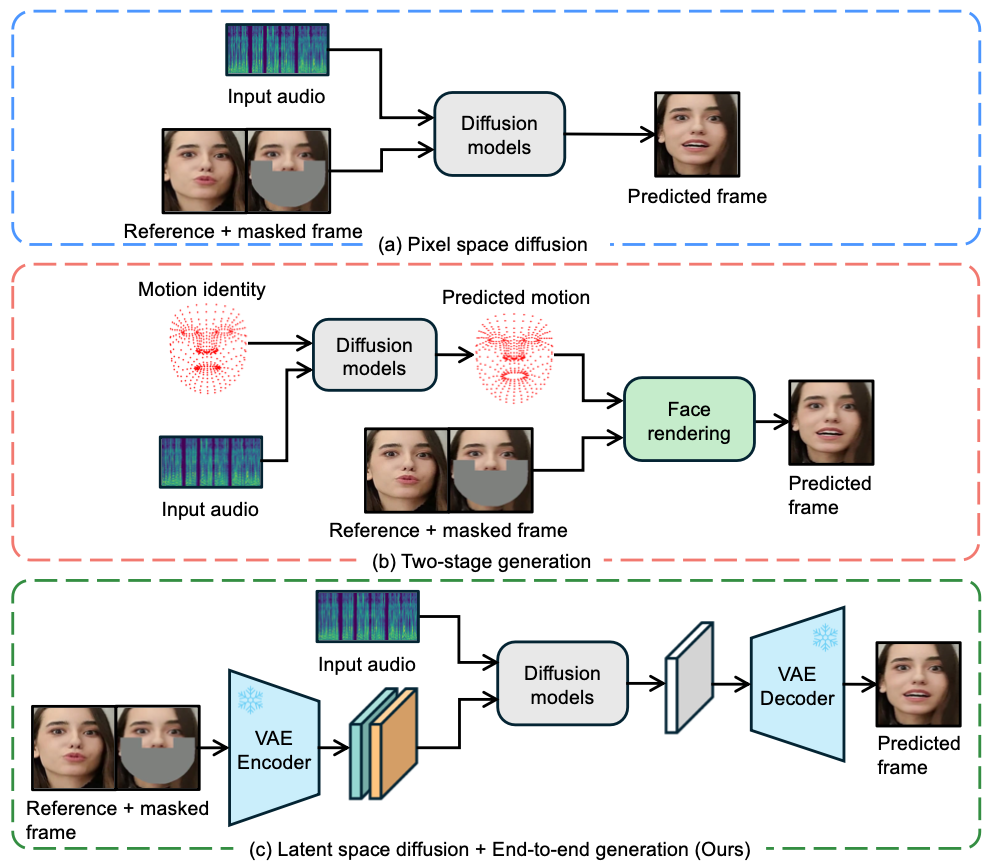

# 1. Introduction

# 2. Related Work
## 2.1. Diffusion-based Lip Sync
`Diff2lip`
`DiffusionVideoEditing`
`MyTalk`
`StyleSync`
`Diffdub`

> `Diff2lip` [Soumik Mukhopadhyay, Saksham Suri, Ravi Teja Gadde, and Abhinav Shrivastava. Diff2lip: Audio conditioned diffusion models for lip-synchronization. In Proceedings of the IEEE/CVF Winter Conference on Applications of Computer Vision, pages 5292–5302, 2024.](https://arxiv.org/abs/2308.09716)

> `DiffusionVideoEditing` [Dan Bigioi, Shubhajit Basak, Michał Stypułkowski, Maciej Zieba, Hugh Jordan, Rachel McDonnell, and Peter Corcoran. Speech driven video editing via an audio-conditioned diffusion model. Image and Vision Computing, 142:104911, 2024.](https://arxiv.org/abs/2301.04474)

> `MyTalk` [Runyi Yu, Tianyu He, Ailing Zeng, Yuchi Wang, Junliang Guo, Xu Tan, Chang Liu, Jie Chen, and Jiang Bian. Make your actor talk: Generalizable and high-fidelity lip sync with motion and appearance disentanglement. arXiv preprint arXiv:2406.08096, 2024.](https://arxiv.org/abs/2406.08096)

> `StyleSync` [Weizhi Zhong, Jichang Li, Yinqi Cai, Liang Lin, and Guanbin Li. Style-preserving lip sync via audio-aware style reference. arXiv preprint arXiv:2408.05412, 2024.](https://arxiv.org/abs/2408.05412)

> `Diffdub` [Tao Liu, Chenpeng Du, Shuai Fan, Feilong Chen, and KaiYu. Diffdub: Person-generic visual dubbing using inpainting renderer with diffusion auto-encoder. In ICASSP 2024-2024 IEEE International Conference on Acoustics, Speech and Signal Processing (ICASSP), pages 3630–3634. IEEE, 2024.](https://arxiv.org/abs/2311.01811)

## 2.2. Non-diffusion-based Lip Sync
`Wav2Lip`
`Generating Ultra-High Resolution TalkingFaces`
`StyleSync`
`VideoReTalking`
`DINet`
`MuseTalk`

> `Wav2Lip` [KR Prajwal, Rudrabha Mukhopadhyay, Vinay P Namboodiri, and CV Jawahar. A lip sync expert is all you need for speech to lip generation in the wild. In Proceedings of the 28th ACM international conference on multimedia, pages 484–492, 2020.](https://arxiv.org/abs/2008.10010)

> `Generating Ultra-High Resolution TalkingFaces` [Anchit Gupta, Rudrabha Mukhopadhyay, Sindhu Balachandra, Faizan Farooq Khan, Vinay P Namboodiri, and CV Jawahar. Towards generating ultra-high resolution talking-face videos with lip synchronization. In Proceedings of the IEEE/CVF Winter Conference on Applications of Computer Vision, pages 5209–5218, 2023.](https://ieeexplore.ieee.org/document/10030232)

> `StyleSync` [Jiazhi Guan, Zhanwang Zhang, Hang Zhou, Tianshu Hu, Kaisiyuan Wang, Dongliang He, Haocheng Feng, Jingtuo Liu, Errui Ding, Ziwei Liu, et al. Stylesync: High-fidelity generalized and personalized lip sync in style-based generator. In Proceedings of the IEEE/CVF Conference on Computer Vision and Pattern Recognition, pages 1505–1515, 2023.](https://arxiv.org/abs/2305.05445)

> `VideoReTalking` [Kun Cheng, Xiaodong Cun, Yong Zhang, Menghan Xia, Fei Yin, Mingrui Zhu, Xuan Wang, Jue Wang, and Nannan Wang. Videoretalking: Audio-based lip synchronization for talking head video editing in the wild. In SIGGRAPH Asia 2022 Conference Papers, pages 1–9, 2022.](https://arxiv.org/abs/2211.14758)

> `DINet` [Zhimeng Zhang, Zhipeng Hu, Wenjin Deng, Changjie Fan, Tangjie Lv, and Yu Ding. Dinet: Deformation inpainting network for realistic face visually dubbing on high resolution video. In Proceedings of the AAAI Conference on Artificial Intelligence, pages 3543–3551, 2023.](https://arxiv.org/abs/2303.03988)

> `MuseTalk` [Yue Zhang, Minhao Liu, Zhaokang Chen, Bin Wu, Yubin Zeng, Chao Zhan, Yingjie He, Junxin Huang, and Wenjiang Zhou. Musetalk: Real-time high quality lip synchronization with latent space inpainting. arXiv preprint arXiv:2410.10122, 2024.](https://arxiv.org/abs/2410.10122)

# 3. Method
## 3.1. LatentSync Framework
### Audio layers
### SyncNet supervision
