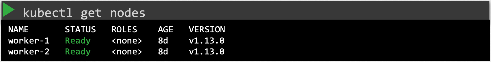
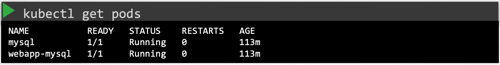
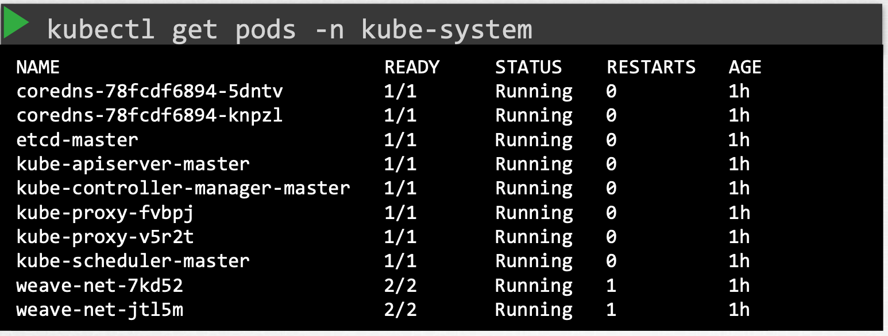
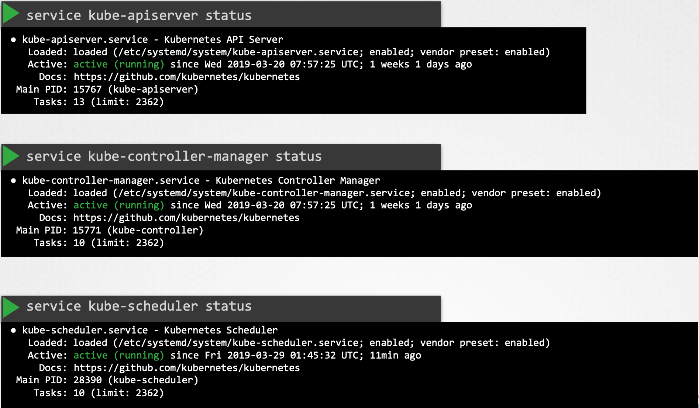
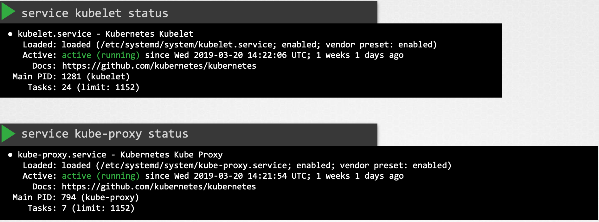
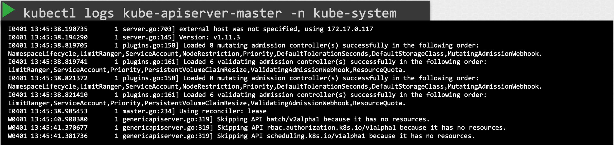
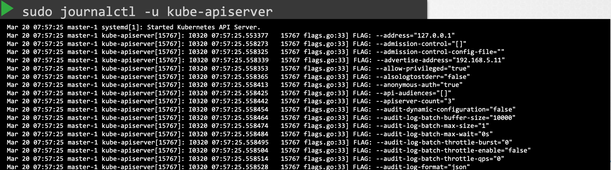

먼저 클러스터 내 노드 상태를 확인한다.

{: width="100%" height="100%"}{: .center}

노드의 상태가 정상이면, 파드의 상태를 확인한다.

{: width="100%" height="100%"}{: .center}

만약 Kubeadm 도구를 사용해 클러스터를 배포했고, 컨트롤 플레인 컴포넌트가 파드로 배포된 경우, `kube-system` 네임스페이스에 있는 파드를 확인한다.

{: width="100%" height="100%"}{: .center}

또는, 컨트롤 플레인 컴포넌트가 서비스로 배포된 경우면 마스터 노드에서는 `kube-apiserver`, `controller-manager`, `scheduler` 등의 서비스 상태를 확인해야 하고,
워커 노드에서는 `kubelet`과 `kube-proxy` 서비스의 상태를 점검해야 합니다.

{: width="100%" height="100%"}{: .center}

{: width="100%" height="100%"}{: .center}

다음으로 컨트롤 플레인 구성 요소의 로그를 확인해야 한다.

Kubeadm을 사용하는 경우에는, 컨트롤 플레인 구성 요소가 포함된 파드의 로그를 확인한다.

{: width="100%" height="100%"}{: .center}

또는, 컨트롤 플레인 구성 요소들이 마스터 노드에 서비스로 직접 구성된 경우에는, 해당 호스트의 로깅 시스템을 통해 서비스 로그를 확인한다.
예를 들어 우리 환경에서는 `journalctl` 유틸리티를 사용해서 로그를 조회할 수 있다.

{: width="100%" height="100%"}{: .center}