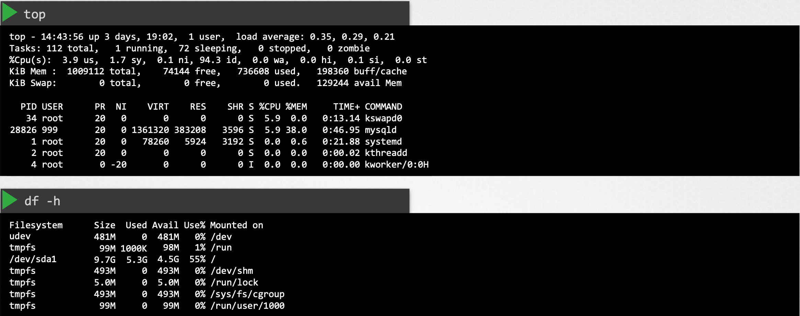
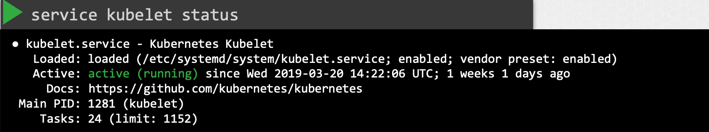

먼저 클러스터 내 노드 상태를 확인한다.

{: width="100%" height="100%"}{: .center}

특정 노드의 상태에 문제가 생겼으면 해당 노드에 대해 확인한다.

{: width="100%" height="100%"}{: .center}

상태에 따라 Status의 각 플래그는 true, false, unknown으로 설정된다.

- 노드에 디스크 공간이 부족하면 OutOfDisk 플래그가 true로 된다.
- 메모리가 부족할 경우 MemoryPressure 플래그가 true로 된다.
- 디스크 용량이 낮으면 DiskPressure 플래그가 true로 된다.
- 실행 중인 프로세스가 너무 많을 경우 PIDPressure 플래그가 true로 된다.
- 그 외 워커노드가 마스터노드와 통신을 멈추면 플래그는 unknown으로 된다.

플래그가 unknown일 경우, 노드가 손실되었을 가능성이 있을 수 있기 때문에 lastHeartbeatTime 필드를 확인해서 노드가 마지막으로 응단한 시점을 파악한다.

이후, 해당 정보를 바탕으로 노드 자체의 상태를 아래와 같이 확인한다.
노드가 여전히 온라인 상태인지, 아니면 충돌했는지 확인합니다.
- 충돌했다면, 다시 부팅한다.
- 노드의 CPU, 메모리, 디스크 공간 등 리소스 상태를 확인한다.
  {: width="100%" height="100%"}{: .center}
- kubelet 서비스의 상태도 점검하세요.
  {: width="100%" height="100%"}{: .center}
- kubelet의 로그를 확인해 문제가 있는지 살펴보세요.
  {: width="100%" height="100%"}{: .center}
- kubelet 인증서도 확인한다.
  - 인증서가 만료되지 않았는지, 적절한 그룹에 속해 있는지, 올바른 CA(Certificate Authority) 로부터 발급받았는지 검증한다.
    {: width="100%" height="100%"}{: .center}